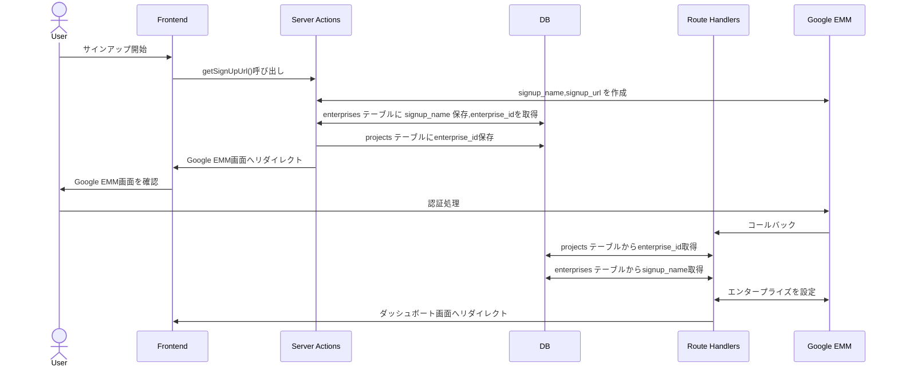

# EMM Enterprise 作成フロー

---

config:
theme: neutral

---

```mermaid
sequenceDiagram
    actor User
    participant Frontend
    participant Server Actions
    participant DB
    participant Route Handlers
    participant Google EMM
    User->>Frontend: サインアップ開始
    Frontend->>Server Actions: getSignUpUrl()呼び出し
    Server Actions<<->> Google EMM: signup_name,signup_url を作成
    Server Actions<<->>DB: enterprises テーブルに signup_name 保存,enterprise_idを取得
    Server Actions->>DB: projects テーブルにenterprise_id保存
    Server Actions->>Frontend: Google EMM画面へリダイレクト
    Frontend->>User: Google EMM画面を確認
    User->>Google EMM: 認証処理
    Google EMM->>Route Handlers: コールバック
    Route Handlers<<->>DB: projects テーブルからenterprise_id取得
    Route Handlers<<->>DB: enterprises テーブルからsignup_name取得
    Route Handlers<<->>Google EMM: エンタープライズを設定
    Route Handlers->>Frontend: ダッシュボート画面へリダイレクト
```
