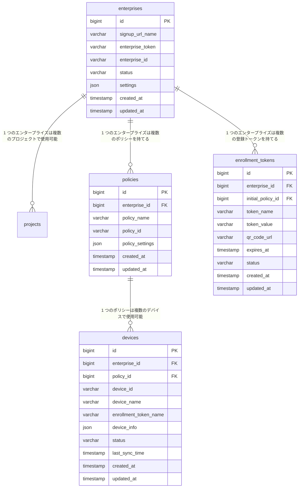

# Android Device Management Database Schema

## Entity Relationship Diagram

```mermaid
erDiagram
enterprises ||--o{ projects : "1 つのエンタープライズは複数のプロジェクトで使用可能"
enterprises ||--o{ policies : "1 つのエンタープライズは複数のポリシーを持てる"
policies ||--o{ devices : "1 つのポリシーは複数のデバイスで使用可能"
enterprises ||--o{ enrollment_tokens : "1 つのエンタープライズは複数の登録トークンを持てる"

    enterprises {
        bigint id PK
        varchar signup_url_name
        varchar enterprise_token
        varchar enterprise_id
        varchar status
        json settings
        timestamp created_at
        timestamp updated_at
    }

    policies {
        bigint id PK
        bigint enterprise_id FK
        varchar policy_name
        varchar policy_id
        json policy_settings
        timestamp created_at
        timestamp updated_at
    }

    devices {
        bigint id PK
        bigint enterprise_id FK
        bigint policy_id FK
        varchar device_id
        varchar device_name
        varchar enrollment_token_name
        json device_info
        varchar status
        timestamp last_sync_time
        timestamp created_at
        timestamp updated_at
    }

    enrollment_tokens {
        bigint id PK
        bigint enterprise_id FK
        bigint initial_policy_id FK
        varchar token_name
        varchar token_value
        varchar qr_code_url
        timestamp expires_at
        varchar status
        timestamp created_at
        timestamp updated_at
    }
```
