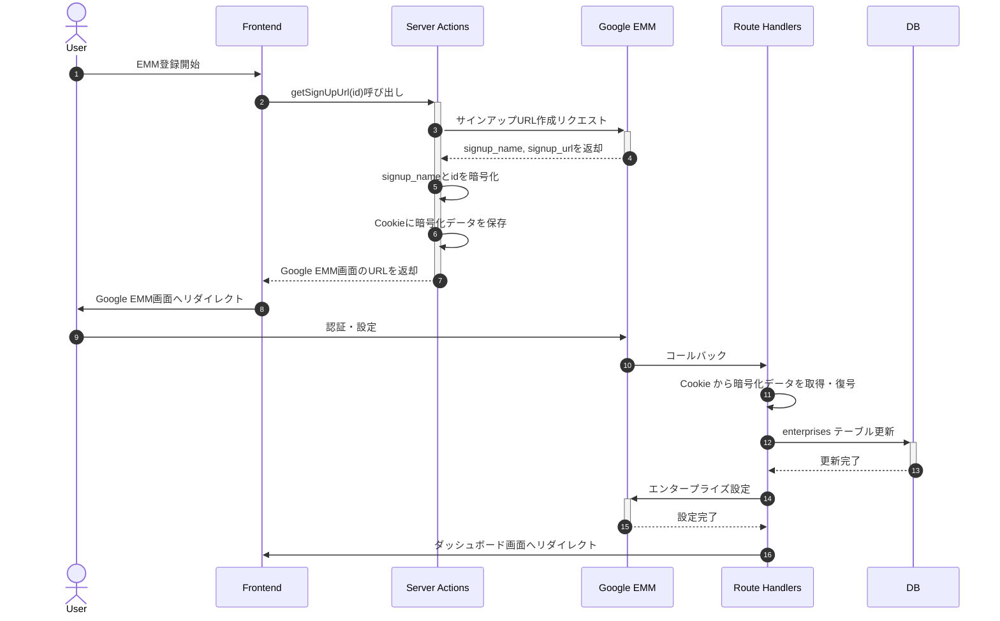

# EMM Enterprise 作成フロー

```mermaid
---

config:

theme: neutral

---

sequenceDiagram
autonumber
actor User
participant Frontend
participant Server Actions
participant Google EMM
participant Route Handlers
participant DB

    User->>Frontend: EMM登録開始
    Frontend->>+Server Actions: getSignUpUrl(id)呼び出し

    Server Actions->>+Google EMM: サインアップURL作成リクエスト
    Google EMM-->>-Server Actions: signup_name, signup_urlを返却
    Server Actions->>Server Actions: signup_nameとidを暗号化
    Server Actions->>Server Actions: Cookieに暗号化データを保存


    Server Actions-->>-Frontend: Google EMM画面のURLを返却
    Frontend->>User: Google EMM画面へリダイレクト

    User->>Google EMM: 認証・設定
    Google EMM->>Route Handlers: コールバック

    Route Handlers->>Route Handlers: Cookie から暗号化データを取得・復号
    Route Handlers->>+DB: enterprises テーブル更新
    DB-->>-Route Handlers: 更新完了

    Route Handlers->>+Google EMM: エンタープライズ設定
    Google EMM-->>-Route Handlers: 設定完了

    Route Handlers->>Frontend: ダッシュボード画面へリダイレクト
```
