# enterprise Database Schema

## テーブル一覧

- users
- enterprises
- projects
- policies
- devices
- events
- operations
- memory_events
- power_management_events
- application_reports
- devices_histories
- enterprises_histories
- pubsub_messages

## 記号の意味

- PK: Primary Key
- FK: Foreign Key
- ||--o{ : 1 対多の関係
- ||--|| : 1 対 1 の関係
- }o--o{ : 多対多の関係
- ex) enterprises ||--o{ projects : "has" は「エンタープライズは複数のプロジェクトを持つ」という意味

## Entity Relationship Diagram

```mermaid
erDiagram
    %% ユーザー管理
    users ||--o{ enterprises : "owns"
    users ||--o{ project_members : "participates"
    %% プロジェクト管理
    enterprises ||--o{ projects : "has"
    projects ||--o{ project_members : "has users"
    %% ポリシー管理
    enterprises ||--o{ policies : "has"
    policies ||--o{ policies_histories : "has"
    policies ||--o{ devices : "has"
    %% デバイス管理
    enterprises ||--o{ devices : "has"
    devices ||--o{ application_reports : "generates"
    devices ||--o{ memory_events : "generates"
    devices ||--o{ power_management_events : "generates"
    devices ||--o{ devices_histories : "has"
    devices ||--o{ operations : "has"
    devices ||--o{ usage_log_events : "has"
    %% アプリ管理
    enterprises ||--o{ apps : "has"
    %% PubSub管理
    pubsub_messages ||--o{ devices_histories : "records"
    pubsub_messages ||--o{ operations : "records"
    pubsub_messages ||--o{ usage_log_events  : "records"
    %% エンタープライズ管理
    enterprises ||--o{ enterprises_histories : "has"

    users {
        uuid user_id PK "auth.users.id , Action referenced row is removed : Set Null ?"
        text email UK
        text username UK
        text stripe_customer_id "Stripe顧客ID"
        timestamptz created_at "Default Value : now()"
        timestamptz updated_at
    }
    projects {
        uuid project_id PK
        uuid owner_id FK "references users(user_id) , Action referenced row is removed : Set Null ?"
        text enterprise_id FK "Action referenced row is removed : Cascade"
        text project_name
        text organization_name
        timestamptz created_at "Default Value : now()"
        timestamptz updated_at
    }
    project_members {
        uuid project_member_id PK "Default Value : gen_random_uuid()"
        uuid project_id FK "Action referenced row is removed : Cascade"
        uuid user_id FK "auth.users.id , Action referenced row is removed : Set Null ?"
        timestamptz created_at "Default Value : now()"
        timestamptz updated_at
    }
    enterprises {
        text enterprise_id PK
        uuid owner_id FK "users.id , Action referenced row is removed : Set Null ?"
        jsonb enterprise_data "最新のresponse_data"
        timestamp created_at "Default Value : now()"
        timestamp updated_at
    }
    enterprises_histories {
        uuid enterprises_history_id PK
        text enterprise_id FK "Action referenced row is removed : Cascade"
        jsonb request_data
        jsonb response_data
        uuid created_by_user_id FK "auth.user.id , Action referenced row is removed : No action ?"
        timestamp created_at "Default Value : now()"
    }
    apps {
        text app_id PK "packageName"
        text enterprise_id FK "Action referenced row is removed : Cascade"
        text app_type
        jsonb app_data
        timestamptz created_at "Default Value : now()"
        timestamptz updated_at
    }
    policies {
        text policy_name PK "displayNameとして使用"
        text enterprise_id PK,FK "Action referenced row is removed : Cascade"
        %% uuid policy_id PK "gen_random_uuid()"
        %% text enterprise_id FK "Action referenced row is removed : Cascade"
        %% text policy_display_name "複合キーにしてindexを設定する?"
        jsonb policy_data "最新のresponse_data"
        timestamptz created_at "Default Value : now()"
        timestamptz updated_at
    }
    policies_histories {
        uuid policy_history_id PK "gen_random_uuid()"
        uuid policy_id FK "Action referenced row is removed : Cascade"
        jsonb request_data
        jsonb response_data
        uuid updated_by_user_id FK "auth.user.id , Action referenced row is removed : No action ?"
        timestamptz created_at "Default Value : now()"
        timestamptz updated_at
    }
    devices {
        uuid device_id PK
        text enterprise_id FK "Action referenced row is removed : Cascade"
        uuid policy_id FK "Action referenced row is removed : Set Null "
        text device_display_name
        jsonb device_data "最新のdevices_historiesのresponse_data"
        jsonb command_data "最新のoperationsのresponse_data, Is Nullable"
        timestamptz created_at "Default Value : now()"
        timestamptz updated_at
    }
    devices_histories {
        uuid device_history_id PK "gen_random_uuid()"
        uuid device_id FK  "Action referenced row is removed : Cascade"
        jsonb request_data "Is Nullable"
        jsonb response_data
        uuid updated_by_user_id FK "auth.user.id , Action referenced row is removed : No action ?,Is Nullable"
        timestamptz created_at "Default Value : now()"
        timestamptz updated_at
    }
    application_reports {
        uuid application_report_id PK "gen_random_uuid()"
        uuid device_history_id FK "Action referenced row is removed : Cascade"
        uuid device_id FK
        jsonb application_report_data
        timestamptz created_at "Default Value : now()"
    }
    memory_events {
        uuid memory_event_id PK "gen_random_uuid()"
        uuid device_history_id FK "Action referenced row is removed : Cascade"
        uuid device_id FK
        jsonb memory_event_data
        timestamptz created_at "Default Value : now()"
    }
    power_management_events {
        uuid power_management_event_id PK "gen_random_uuid()"
        uuid device_history_id FK "Action referenced row is removed : Cascade"
        uuid device_id FK
        jsonb power_management_event_data
        timestamptz created_at "Default Value : now()"
    }
    operations {
        uuid operation_id PK "gen_random_uuid()"
        text enterprise_id FK "Action referenced row is removed : Cascade"
        jsonb request_data
        jsonb response_data
        uuid created_by_user_id FK "auth.user.id , Action referenced row is removed : No action ?"
        timestamptz created_at "Default Value : now()"
    }
    usage_log_events {
        uuid usage_log_event_id PK "gen_random_uuid()"
        text enterprise_id FK "Action referenced row is removed : Cascade"
        jsonb usage_log_event_data
        timestamptz created_at "Default Value : now()"
    }
    pubsub_messages {
        text pubsub_message_id PK
        text enterprise_id FK "Action referenced row is removed : Cascade"
        text notification_type
        jsonb pubsub_message_data
        timestamptz pubish_time
        timestamptz created_at "Default Value : now()"
    }

```

