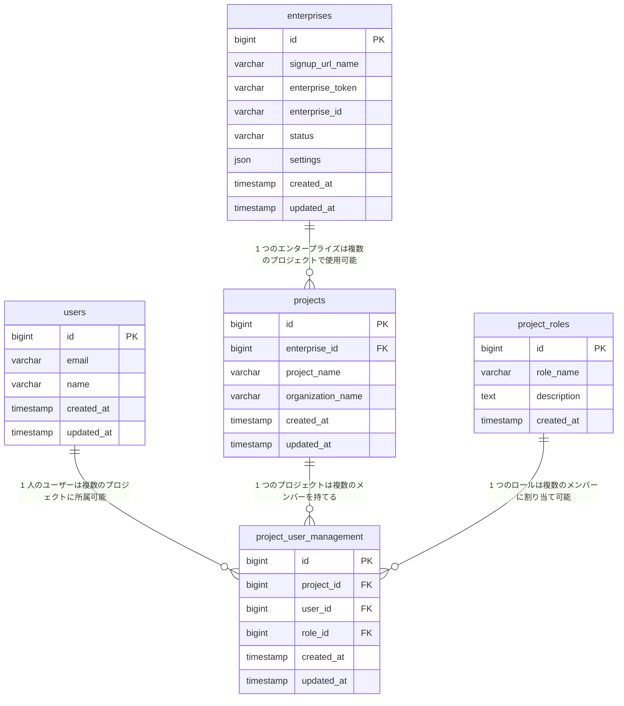

# Project and Enterprise Management Database Schema

## Entity Relationship Diagram

```mermaid
erDiagram
users ||--o{ project_user_management : "1 人のユーザーは複数のプロジェクトに所属可能"
projects ||--o{ project_user_management : "1 つのプロジェクトは複数のメンバーを持てる"
project_roles ||--o{ project_user_management : "1 つのロールは複数のメンバーに割り当て可能"
enterprises ||--o{ projects : "1 つのエンタープライズは複数のプロジェクトで使用可能"

    users {
        bigint id PK
        varchar email
        varchar name
        timestamp created_at
        timestamp updated_at
    }

    projects {
        bigint id PK
        bigint enterprise_id FK
        varchar project_name
        varchar organization_name
        timestamp created_at
        timestamp updated_at
    }

    enterprises {
        bigint id PK
        varchar signup_url_name
        varchar enterprise_token
        varchar enterprise_id
        varchar status
        json settings
        timestamp created_at
        timestamp updated_at
    }

    project_roles {
        bigint id PK
        varchar role_name
        text description
        timestamp created_at
    }

    project_user_management {
        bigint id PK
        bigint project_id FK
        bigint user_id FK
        bigint role_id FK
        timestamp created_at
        timestamp updated_at
    }
```
